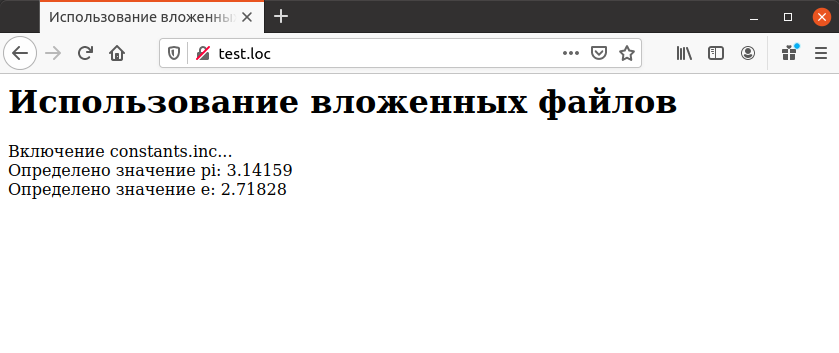

## 4.17 Вложенные файлы
Как уже было сказано, функции позволяют разбивать кол на отдельные 
фрагменты, которые могут быть повторно использованы снова и снова. Но помимо
функций, в РНР существует еще одно средство для повторного использования
кода — вложенные файлы. Такой файл содержит код, который будет включен в
тело основного скрипта в том месте, где использован соответствующий оператор
`include`.
Например, требуется описать несколько числовых констант, которые будут
использоваться в различных скриптах. Для этого создается файл
`constants . inc`, содержащий необходимые описания. В РНР в качестве 
расширения для вложенных файлов обычно используется `inc`, но ничто не мешает спользовать и традиционное расширение `php` (в частности для того, чтобы пользователи не могли загрузить вложенные файлы напрямую без исполнения).
Пример 4.15 показывает содержимое вложенного файла. Следует обратить 
внимание, что и во вложенных файлах также требуется использования синтаксиса `<?php.. . ?>`.  

Пример 4.15. Вложенный файл
```php
<?php
   define ("pi",3.14159);
   define ("e",2.71828);
?>
```
Для того, чтобы использовать данный файл в скрипте, применяется оператор
`include ("constants.inc")`, как в примере 4.16. Файл должен находиться в том же каталоге, что и ссылашающийся на него скрипт. Константы, описанные во вложенном файле, становятся доступными и могут быть использованы в скрипте.

Пример 4.16. Использование вложенных файлов
```php
<HTML>
    <HEAD>
        <TITLE>
            Использование вложенных файлов
        </TITLE>
    </HEAD>
    <BODY>
        <H1>
            Использование вложенных файлов
        </H1>
        <?php
            echo "Включение constants.inc...<BR>";
            include("constants.inc");
            echo "Определено значение pi: ",pi, "<BR>";
            echo "Определено значение е: ",e, "<BR>"; 
        ?>
    </BODY>
</HTML>
```
Рис. 4.15 демонстрирует успешное отображение значений констант, описанных во вложенном файле.  

*****  
Рис.4.15. Использование вложенных файлов  
Во вложенных файлах может размещаться произвольный код, в частности
функции или целые библиотеки функций. Пример 4.17 описывает функцию
`included_function` во вложенном файле, которая используется в 
примере 4.18.
```php
<?php
   function included_function ()
   {
      echo "Это функция included_function ()!<BR>";
   }
?>
```
Пример 4.18. Использование функций во вложенном файле
```php
<HTML>
    <HEAD>
        <TITLE>
            Использование вложенных файлов
        </TITLE>
    </HEAD>
    <BODY>
        <H1>
            Использование вложенных файлов
        </H1>
        <?php
            echo "Включение function.inc....<BR>";
            include ("function.inc") ;
            included_function();
        ?>
    </BODY>
</HTML>
```
На рис 4.16 приведен результат успешного вызова функции oписанной во вложенном файле.

