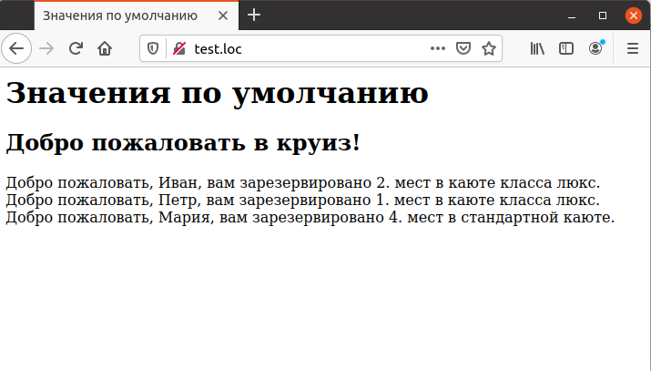

## 4.4 Значения аргументов по умолчанию 
В предыдущем разделе было показано, как передавать данные в функцию 
через ее аргументы. Например, следующая функция просто отображает 
переданную ей строку:
```php
function greeting($text)
{
    echo Stext, "\n";
}
greeting ("С добрым утром!");
```
Такую функцию можно по ошибке вызвать без указания аргумента:
`greeting ();`
В этом случае будет выведено сообщение об ошибке:
```
PHP Warning: Missing argument 1 for greeting() in
C:\php\test.php on line 5
```
Для того, чтобы избежать подобной ситуации, аргументу функции можно
присвоить значение по умолчанию, которое будет использоваться, если при 
вызове аргумент не задан. Это достигается при помощи знака `=` и указания 
соответствующего значения:
```php
<?php
function greeting ($text = "Хорошая погода")
{
    echo $text, "\n";
}
greeting () ;
?>
```
Данный фрагмент кода отобразит следующий текст:

Хорошая погода

Если аргумент функции задан в явной форме, значение по умолчанию не 
используется. Значение по умолчанию может бьпъ задано больше чем для одного аргумента, но после того, как оно будет задано для одного из них, оно должно быть задано и для всех последующих аргументов до конца списка, чтобы исключить неоднозначность, если какой-либо из аргументов будет опущен. Ниже приведен пример подобной функции:
```php
function greeting ($textl, $text2 = "Без ", $text = "паники.")
{
    echo Stextl, $text2, $text3, "\n";
}
```
Пример 4.3 демонстрирует использование значений аргументов функции по умолчанию. Пример предназначен для бронирования кают на круизном лайнере, по умолчанию бронируется двухместная каюта класса люкс.
```php
<HTML>
    <HEAD>
        <TITLE>
            Значения по умолчанию
        </TITLE>
    </HEAD>
    <BODY>
        <H1>
            Значения по умолчанию
        </H1>
        <H2>
            Добро пожаловать в круиз!
        </H2>
        <?php
            function book ($name, $number = 2, $deluxe = TRUE)
            {
                echo "Добро пожаловать, $name, вам зарезервировано $number.
                мест";
                
                if ($deluxe)
                    echo " в каюте класса люкс.<BR>";
                else
                    echo " в стандартной каюте.<BR>";
            }
            book ("Иван");
            book ("Петр", 1 ) ;
            book ("Мария", 4, FALSE);
        ?>
    </BODY>
</HTML>
```

*****
<center>Рис. 4.3. Использование значений по умолчанию</center>  

На рис. 4.3 видно, что явное задание аргумента функции перекрывает 
значение по умолчанию.