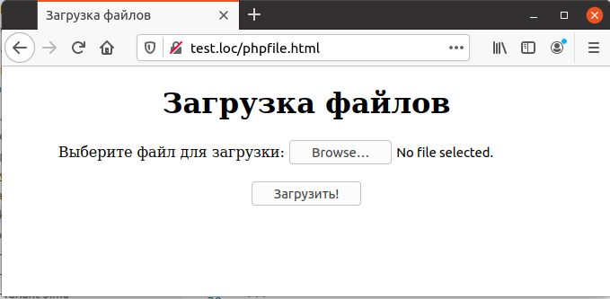

## 5.11 Загрузка файлов
При помощи HTML-форм можно загружать файлы на web-сервер, и РНР 
полностью поддерживает этот механизм. Для этого используется специальный тип формы с типом данных `«multipart/form-data»`, который задается в атрибуте `ENCTYPE` тега `<FORM>`.  
Метод передачи данных и скрипт-обработчик задаются как обычно. Чтобы добавить к форме поле для выбора имени загружаемого файла, используется тег `<INPUT TYРE=FILE>`. Пример 5.17 содержит форму, содержащую подобное поле с именем userfile.  

Пример 5.17. Форма для загрузки файла, phpfile.html
```php
<HTML>
    <HEAD>
        <TITLE>
            Загрузка файлов
        </TITLE>
    </HEAD>
    <BODY>
        <CENTER>
            <H1>
                Загрузка файлов
            </H1>
            <FORM
                ENCTYPE="multipart/form-data"
                ACTION="phpfile.php" method="post">
                Выберите файл для загрузки: <INPUT NAME="userfile" TYPE="file">
                <BR>
                <BR>
                <INPUT TYPE="submit" VALUE="Загрузить!">   
            </FORM>
        </CENTER>
    </BODY>
</HTML> 
```  
Форма, описанная в примере 5.17, представлена на рис. 5.17. Следует обратить внимание, что тег `<INPUТ type=file>` описывает одновременно и поле для ввода имени файла, и кнопку «Обзор» для выбора его при помощи диалогового окна. После ввода или выбора имени файла для загрузки следует нажать кнопку «Загрузить!».  

  

Рис. 5.17. Форма для загрузки файла