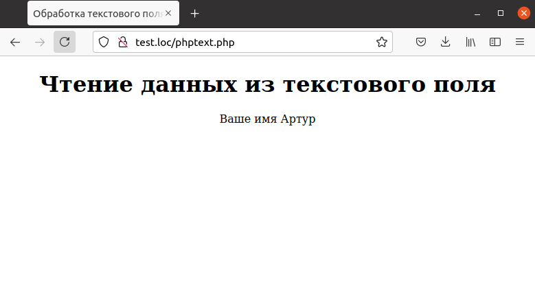

## 5.3 Получение данных из текстовых полей
Для того чтобы получить доступ к данным, переданным скрипту
из HTML-формы, используются суперглобальные массивы [`$_GET`](https://www.php.net/manual/ru/reserved.variables.get.php) ИЛИ [`$_POST`](https://www.php.net/manual/ru/reserved.variables.post)
для способов передачи `GET` и `POST` соответственно. Для обеспечения независимости от способа передачи данных рекомендуется использовать массив [`$_REQUEST`](https://www.php.net/manual/ru/reserved.variables.request),
который содержит данные из обоих этих массивов. В предыдущем разделе использовалось текстовое поле с именем «Name», заданным в атрибуте `NAME` Значение этого поля может быть получено как элемент массива `$_REQUEST`[ "Name" ], как показано в примере 5.2.

Пример 5.2. Чтение данных из текстового поля, phptext.php
```php
<HTML>
    <HEAD>
        <TITLE>
            Обработка текстового поля
        </TITLE>
    </HEAD>
    <BODY>
        <CENTER>
            <H1>Чтение данных из текстового поля</H1>
            Ваше имя
            <?php
                echo $_REQUEST["Name"];
            ?>
        </CENTER>
    </BODY>
</HTML>
```
Результат выполнения данного примера показан на рис. 5.2.

*****
Как видно, доступ к данным HTML-формы осуществляется при помощи 
обращения к элементу массиву `$ REQUEST ["ControlName"]`, где `ControlName` — название элемента управления, например, текстового поля. Если способ передачи данных известен заранее и не меняется, можно также использовать массивы `$_GET` или `$_POST`, например, для обработки формы из примера 5.1 можно также использовать следующий код:
```php
<?php
    echo $_POST ["Name"];
?>
```